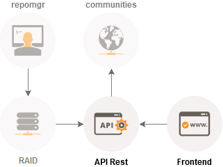

## Introduction

Nand is a repository syncronized with internet communities in order to collect precised and acurrated information about ROM videogames. Our goal is contribute to preserve full dumps ensure that future generations aren't provided of our video game history.

This mirror works storing data redundantly on multiple disks to protect information in the case of drive failure. We don't provide download links to copyrighted material or information where to find them.

- **Frontend:** http://www.nand.me
- **API Rest:**  https://swaggerhub.com/apis/joseluisluri/nand/1.0.0
- **RAID:** non shared
- **repomgr:** ROM handling utility https://github.com/joseluisluri/repomgr
- **communities:** [no-intro](http://www.no-intro.org/), [redump](http://www.redump.org/) and [tosec](http://www.tosecdev.org).

## Technologies
### API
- Python 3.x 
- Django 1.x
- MongoDB 3.4.x
- SQLite 3.x

### Frontend
- AngularJS 4.x
- PrimeNG 4.x
- Bootstrap v4-alpha
- jQuery 3.x

## License
Copyright (c) 2017 José Luis Luri. All rights reserved.

Redistribution and use in source and binary forms, with or without modification, are permitted provided that the following conditions are met:

1. Redistributions of source code must retain the above copyright notice, this list of conditions and the following disclaimer.

2. Redistributions in binary form must reproduce the above copyright notice, this list of conditions and the following disclaimer in the documentation and/or other materials provided with the distribution.

THIS SOFTWARE IS PROVIDED BY JOSÉ LUIS LURI ''AS IS'' AND ANY EXPRESS OR IMPLIED WARRANTIES, INCLUDING, BUT NOT LIMITED TO, THE IMPLIED WARRANTIES OF MERCHANTABILITY AND FITNESS FOR A PARTICULAR PURPOSE ARE DISCLAIMED. IN NO EVENT SHALL OR CONTRIBUTORS BE LIABLE FOR ANY DIRECT, INDIRECT, INCIDENTAL, SPECIAL, EXEMPLARY, OR CONSEQUENTIAL DAMAGES (INCLUDING, BUT NOT LIMITED TO, PROCUREMENT OF SUBSTITUTE GOODS OR SERVICES; LOSS OF USE, DATA, OR PROFITS; OR BUSINESS INTERRUPTION) HOWEVER CAUSED AND ON ANY THEORY OF LIABILITY, WHETHER IN CONTRACT, STRICT LIABILITY, OR TORT (INCLUDING NEGLIGENCE OR OTHERWISE) ARISING IN ANY WAY OUT OF THE USE OF THIS SOFTWARE, EVEN IF ADVISED OF THE POSSIBILITY OF SUCH DAMAGE.

The views and conclusions contained in the software and documentation are those of the authors and should not be interpreted as representing official policies, either expressed or implied, of José Luis Luri.